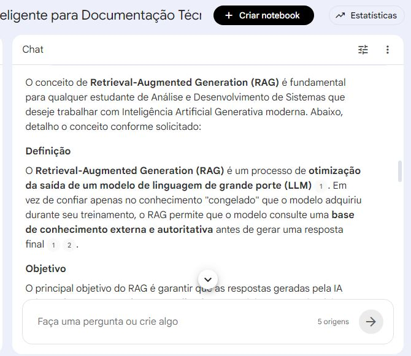
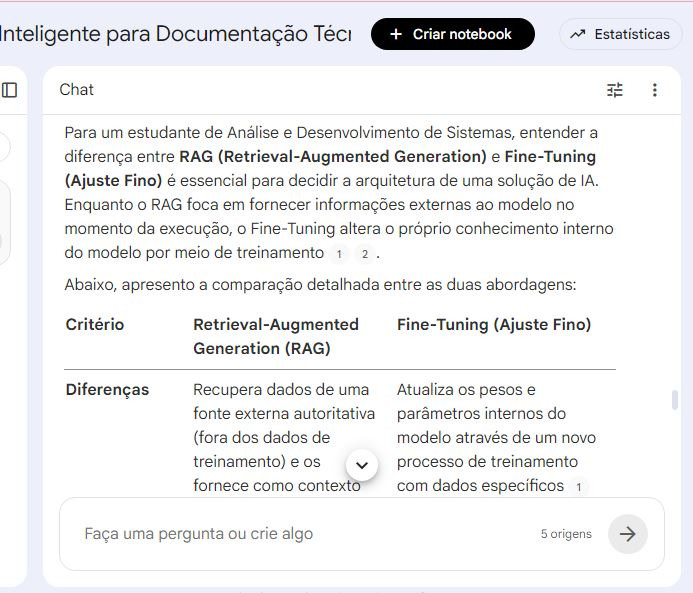
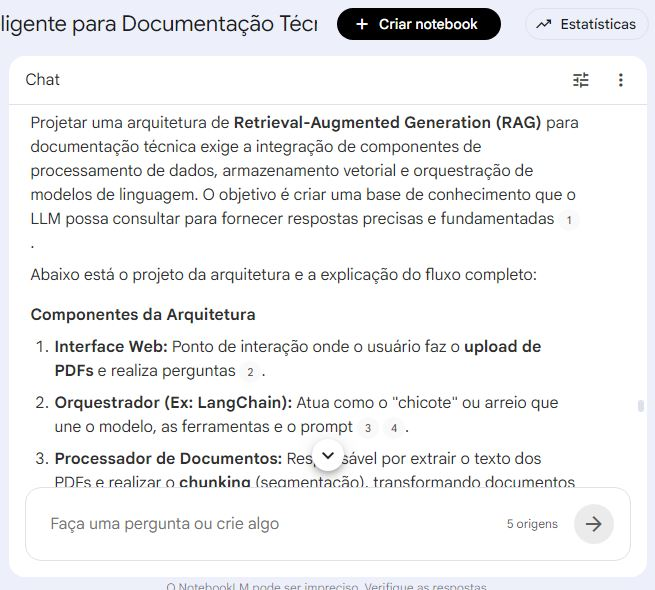
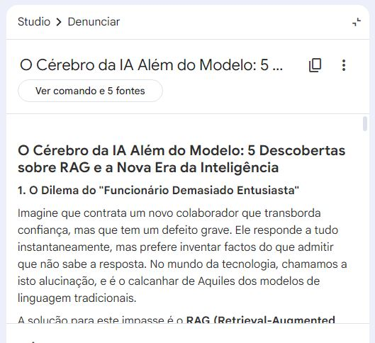
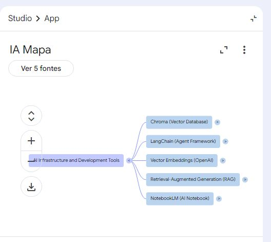

# 🚀 TechDoc AI - Miniguia de Estudos com NotebookLM

## 📖 Sobre o Projeto

Este projeto foi desenvolvido como parte do desafio da DIO no Bootcamp **Afya - Automação de Dados com IA**, utilizando o NotebookLM como ferramenta de aprendizagem ativa.

O objetivo foi explorar conceitos fundamentais de **Inteligência Artificial Generativa aplicada à organização do conhecimento**, com foco na arquitetura **RAG (Retrieval-Augmented Generation)**.

O estudo simula a construção de um assistente inteligente capaz de apoiar desenvolvedores na consulta de documentações técnicas, APIs e bases de conhecimento.

---

## 🎯 Objetivos de Aprendizado

- Compreender o funcionamento da arquitetura RAG
- Entender o papel de embeddings em IA
- Explorar busca semântica aplicada a documentos
- Diferenciar RAG e Fine-Tuning
- Aplicar engenharia de prompts na prática
- Utilizar o NotebookLM como ferramenta de estudo estruturado

---

## 📚 Curadoria de Fontes

As fontes utilizadas no NotebookLM foram:

- LangChain Documentation  
- ChromaDB Documentation  
- OpenAI Embeddings Guide  
- AWS - What is RAG  
- NotebookLM Official Documentation  

Essas fontes foram utilizadas para construção do caderno temático e base de conhecimento do projeto.

---

## 🧠 Engenharia de Prompts

Durante o desenvolvimento, foram testados diferentes prompts para explorar o comportamento da IA.

### Prompt 1 - Conceito de RAG
```text
Explique Retrieval-Augmented Generation para um estudante de ADS.
````
### Prompt 2 - Comparação
```text
Compare Fine-Tuning e RAG com vantagens e desvantagens.
```
### Prompt 3 - Arquitetura
```text
Projete uma arquitetura de sistema RAG para documentação técnica.
```
### Prompt 4 - Desafios
```text
Quais os principais desafios na construção de sistemas RAG?
```
---

## ⚠️ Aprendizados e Troubleshooting

Durante os testes foram identificados pontos importantes:

- Prompts genéricos geram respostas superficiais
- Contexto técnico melhora a qualidade da resposta
- Dividir perguntas melhora a precisão da IA
- RAG depende fortemente da qualidade das fontes

# 📸 Evidências do Projeto

## 📚 Fontes no NotebookLM


---

## 🧠 Prompt sobre RAG



---

## ⚖️ Fine-Tuning vs RAG



---

## 🏗️ Arquitetura RAG



---

## 📊 Resumo Gerado



---

## 🧭 Mapa Mental



# 📘 Miniguia de Estudo

## O que é RAG?

**RAG (Retrieval-Augmented Generation)** é uma arquitetura que combina recuperação de informações com geração de texto por IA.

Ela permite que modelos de linguagem consultem fontes externas antes de gerar respostas.

## 🔧 Como funciona

1. O usuário faz uma pergunta  
2. O sistema busca documentos relevantes  
3. Os documentos são convertidos em embeddings  
4. Um banco vetorial encontra similaridades  
5. A IA gera a resposta baseada no contexto  

## 🧩 Componentes principais

- LLM (modelo de linguagem)
- Embeddings
- Banco vetorial
- Chunking de documentos
- Busca semântica

## 💼 Aplicação Profissional

Este conhecimento pode ser aplicado na construção de:

- Assistentes inteligentes para documentação técnica  
- Sistemas de busca semântica corporativa  
- Chatbots baseados em conhecimento interno  
- Ferramentas de suporte para equipes de TI  
- Soluções de automação de conhecimento

## 🚀 Conclusão

Este projeto demonstrou como a Inteligência Artificial pode ser utilizada como ferramenta de estudo estruturado e engenharia de conhecimento.

Além dos conceitos técnicos de RAG, o uso do NotebookLM permitiu organizar, sintetizar e aprofundar o aprendizado de forma prática.

O resultado é um material que pode ser reutilizado como base de estudo e também aplicado em soluções reais no mercado de tecnologia.

## 👨‍💻 Autor

Projeto desenvolvido por: Cristiano Costa

Bootcamp: Afya - Automação de Dados com IA (DIO)  
Ano: 2026

